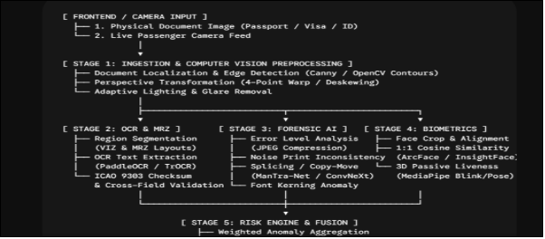
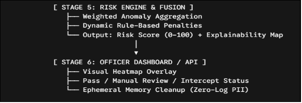

## Problem Statement ID: 26188

### Title: AI-Based Fake Identity and Document Screening System

An AI-powered document verification system acts like an automated digital forensic officer at border security checkpoints, scanning physical or digital travel documents (passports, visas, IDs), checking for digital and physical alterations, parsing MRZ/text, and verifying the traveler's live face against the document photo within seconds.

**Step-by-Step Implementation Pipeline**

To build this end-to-end for a hackathon prototype, structure your architecture into four sequential stages:

1. **Preprocessing & Document Detection:**
   1. Use **OpenCV** for perspective correction, deskewing, and glare removal.
   1. Train a lightweight **YOLOv8** model to segment document regions (Photo ID zone, Visual Inspection Zone (VIZ), and Machine Readable Zone (MRZ)).
1. **OCR & MRZ Extraction (Module 1):**
   1. **MRZ Extraction:** Use PassportEye or regular expressions to parse 2-line (TD3) or 3-line (TD1/TD2) MRZ formats.
   1. **Visual Text Extraction:** Run **PaddleOCR** or **TrOCR** on text regions (Name, Date of Birth, Expiry).
1. **Rule-Based Validation (Module 2):**
   1. Validate standard ICAO 9303 checksum digits computed over passport numbers, dates of birth, and expiry dates against the MRZ check characters.
   1. Cross-verify parsed MRZ data against the visual text extracted by OCR to spot mismatched fields.
1. **Tampering & Forgery Detection (Module 3 - Core Innovation):**
   1. **Error Level Analysis (ELA):** Detect inconsistent JPEG compression artifacts around replaced photos and modified text blocks.
   1. **Copy-Move & Splicing Forgery Detection:** Use convolutional feature extraction (e.g., ManTra-Net or a fine-tuned ResNet) to identify spliced or cloned stamps/signatures.
   1. **Font & Alignment Consistency:** Detect unnatural kerning or irregular font glyphs in modified date or name fields.
   1. **EXIF/Metadata Inspection:** Detect software signatures (e.g., Photoshop) if working with digital uploads.
1. **Face Verification & Anti-Spoofing (Module 4):**
   1. Crop the passport photo and capture a live webcam image.
   1. Compute cosine similarity between face embeddings using **InsightFace (ArcFace)** or **FaceNet**.
   1. Add a passive liveness check (blink/head-pose detection using **MediaPipe**) to prevent presentation attacks (e.g., holding up a phone photo).
1. **Unified Risk Scoring:**
   1. Aggregate weighted anomaly scores into a single composite score (0--100):
      1. *Green (Score < 20):* Clear / Fast-track.
      1. *Yellow (20–50):* Manual secondary inspection required.
      1. *Red (> 50):* High forgery/impersonation probability.

**Advantages & Disadvantages**

|**Dimension**|**Advantages**|**Disadvantages & Limitations**|
| :- | :- | :- |
|**Operational Efficiency**|Reduces inspection time from 2–3 minutes to under 3 seconds per passenger; lowers checkpoint queues.|Requires edge compute (GPU/NPU) at every booth for instant inference.|
|**Detection Quality**|Catches pixel-level edits, micro-font inconsistencies, and copy-pasted stamps invisible to human eyes.|High false-positive rates on damaged, creased, or faded genuine documents.|
|**Standardization**|Eliminates officer fatigue and subjective guesswork; creates an auditable digital log.|Cannot inspect physical security inks (UV watermarks, RFID chips, holograms) with standard RGB cameras alone.|

**What Evaluators (SIH/Hackathon Judges) Specifically Look For**

1. **Working Live Demo (Not Mockups):**
   1. A functioning pipeline where you feed an unaltered passport image vs. a tampered image (with an edited date or swapped face), and the system flags the exact modified region.
1. **Explainability & Localization (XAI):**
   1. Do not just output "Tampered: 85%". Generate a **visual heatmap** (Grad-CAM or bounding boxes) highlighting *where* the manipulation occurred (e.g., "Mismatched compression around Photo Box").
1. **ICAO Doc 9303 Compliance:**
   1. Showing that your team understands official passport standards (calculating modulus check digits on MRZ data) proves practical domain knowledge over generic computer vision wrappers.
1. **Offline & Edge Capability:**
   1. Border security often requires zero internet reliance for data privacy. Demonstrating that your model runs locally (via ONNX / TensorRT) on an edge device or local server is a major scoring boost.
1. **Real-Time Latency:**
   1. End-to-end processing (OCR + Tamper Check + Face Match) completed in ≤2--4 seconds.

**Key Pitfalls to Address**

- **Dataset Constraints:** Training forgery detectors requires synthetic data. Build a script to generate your own altered passport dataset (splicing photos, altering fonts, blurring stamps).
- **Glare & Lighting:** Document laminates reflect ambient booth light. Implement adaptive thresholding and specular reflection removal in your OpenCV pipeline.
- **Data Privacy (DPDP / GDPR):** Emphasize that biometric and PII data is processed ephemerally in RAM without persistent plaintext storage.

**Existing Market Solutions**

This is an established commercial domain; understanding existing solutions will help you position your prototype:

- **Regula Forensics:** Industry gold standard for border control, combining specialized multi-spectral hardware (UV, IR, white light) with automated database checks across 10,000+ document templates.
- **Onfido / Jumio / Veriff:** Cloud-first identity verification (IDV) platforms used in fintech and airline check-ins for document authenticity and selfie-to-ID matching.
- **IDEMIA / SITA:** Large-scale automated border control (e-Gates) deployed at international airports.

**1. High-End Border & Airport Systems (Hardware + Software)**

These are multi-million-dollar systems used at international airports, immigration checkpoints, and automated e-Gates:

- **Regula Forensics:** The global standard used by border agencies, police, and Interpol. They build physical scanner boxes equipped with multi-spectral light sources (White light, UV, Infrared, and Coaxial light) linked to a proprietary reference database of over 16,000 document templates from around the world. 
- **Thales Group & IDEMIA:** The companies behind biometric e-Gates at major airports. They read physical RFID chips embedded in e-Passports, verify cryptographic signatures, and perform 1:1 live facial/iris biometrics at border gates. 
- **Veridos / SITA:** Provide complete border management suites including self-service kiosks, passport readers, and automated background database check integrations. 

**How they work:** They do not just inspect images—they use hardware-level physical checks (UV watermarks, micro-printing, infrared ink absorption, and encrypted RFID chips). 

**2. Commercial Online IDV (Identity Verification) Platforms**

These are cloud-based identity verification platforms used by banks, fintech apps, and airlines for remote onboarding and KYC (Know Your Customer): 

- **Onfido (now Entrust), Jumio, Veriff, and Persona:**
  - Users take a photo of their passport/ID with a smartphone. 
  - The cloud AI extracts text using OCR, checks the Machine Readable Zone (MRZ), and runs neural networks to detect 2D tampering (e.g., photo swapping, text replacement, screen replays). 
  - They run **Liveness Detection** (detecting if a live person is present vs. a photo/video playback) and match the selfie against the ID photo. 

**3. Open-Source AI Models & Forensic Tools**

Developers and researchers already have access to several open-source modules:

- **OCR & MRZ Parsers:** PassportEye, PaddleOCR, Tesseract OCR, and easyocr.
- **Face Biometrics:** DeepFace, InsightFace (ArcFace), and FaceNet.
- **Image Forensics:**
  - **Error Level Analysis (ELA):** Detects differences in JPEG compression levels.
  - **ManTra-Net & TruFor:** Deep learning models that detect image manipulation, copy-paste (splicing), and removal artifacts.
  - **Noise Inconsistency Detectors:** Finds variations in sensor noise patterns across different sections of an image.

**What's Missing / What Makes Your Project Unique?**

If big companies already do this, why is this a hackathon problem?

1. **High Hardware Cost:** Systems like Regula or e-Gates require expensive dedicated optical scanners. A software-first AI solution that works with standard HD webcams or mobile cameras can be deployed at low-budget checkpoints, land borders, and transit desks. 
1. **Offline & Edge Capability:** Most cloud IDV tools (like Jumio/Onfido) send data to remote servers. National security agencies often require **100% offline, local-network processing** to prevent sensitive citizen data leaks. 
1. **Multi-Document Support for Non-Standard IDs:** Big systems are optimized for ICAO standard e-passports. They often struggle with local driving licenses, stamped entry visas, or temporary paper permits where format standards vary. 

